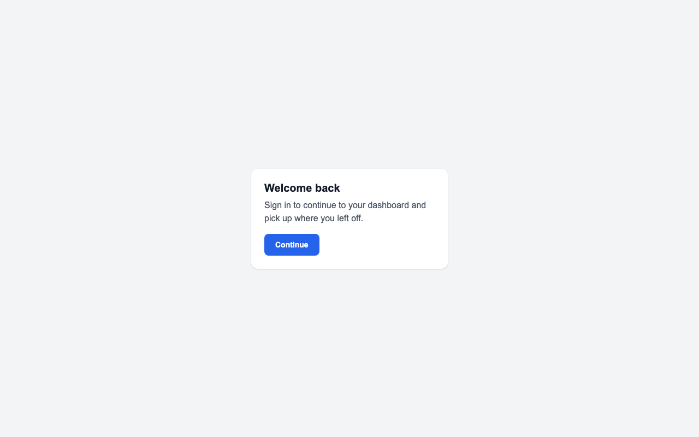
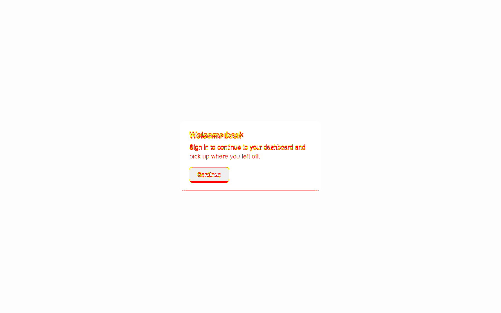

<div align="center">

# 🎯 PixelPilot

### Pixel-perfect UI migration — measured, not guessed.

PixelPilot gives AI coding agents **eyes, a scoreboard, and a stop condition** so they can port a UI from one framework to another and actually match the original — down to the pixel.

[](https://github.com/overseek944/pixelpilot/actions/workflows/ci.yml)
[](LICENSE)


[](CONTRIBUTING.md)

</div>

---

## See it in one picture

You migrate a card component. It *looks* fine. PixelPilot renders both, overlays them, and shows you the truth — every pixel that drifted, plus exactly which CSS property caused it.

| Source (baseline) | Migrated (target) | PixelPilot diff |
| :---: | :---: | :---: |
|  |  |  |

```
PixelPilot FAIL — "demo" (1 cell)
  [OFF] demo__desktop__light   diff=0.333%   ssim=0.9845

Top deltas (demo__desktop__light):
- #body:  moved 0,+3.5px; line-height: 22px (want 24px); color: rgb(107,114,128) (want rgb(75,85,99))
- #title: moved 0,+4.5px; font-size: 19px (want 20px);  color: rgb(31,41,55)  (want rgb(17,24,39))
- #cta:   size 0,-4px;    padding-top: 10px (want 12px); border-radius: 6px (want 8px)
```

That last block is the magic: not "92% match," but **a precise, machine-readable to-do list** an agent can act on and a human can trust.

---

## Table of contents

- [Why PixelPilot exists](#why-pixelpilot-exists)
- [How it works](#how-it-works)
- [Features](#features)
- [Architecture](#architecture)
- [Quick start (60 seconds)](#quick-start-60-seconds)
- [Use it on your own project](#use-it-on-your-own-project)
- [Three ways to plug it into AI agents](#three-ways-to-plug-it-into-ai-agents)
- [CLI reference](#cli-reference)
- [Configuration](#configuration)
- [How the diff actually works](#how-the-diff-actually-works)
- [Scope & honest limitations](#scope--honest-limitations)
- [Extending to native (iOS / Android / RN)](#extending-to-native-ios--android--rn)
- [FAQ](#faq)
- [Roadmap](#roadmap)
- [Project layout](#project-layout)
- [Contributing](#contributing)
- [License](#license)

---

## Why PixelPilot exists

Migrating a UI — React → Vue, an old design system → a new one, a redesign — is mostly a *visual* problem. But AI agents (and humans) do it as a *source-code* problem: read the old code, write new code, hope the pixels line up.

They never fully do. An agent translating source → source has **no visual ground truth and no feedback signal**, so it stalls at ~80–90%. The last 10% — exact line-height, sub-pixel spacing, baseline alignment, a 2px padding drift — isn't recoverable from the source semantics. **It only exists in the render.**

> **The core insight:** pixel-perfection is a property of the *rendered output*, not the source code. So the visual diff should be the objective function — and the agent should be *minimizing a measured error*, not guessing from abstractions.

PixelPilot makes that real.

---

## How it works

It gives the agent the three things it's missing:

| The agent lacks… | PixelPilot provides… |
| --- | --- |
| 👁️ **Eyes** | Renders source & target across a viewport × theme matrix and screenshots them. |
| 📊 **A scoreboard** | Per-region deltas: `#cta moved 0,+4px; padding-top 10px vs 12px; radius 6px vs 8px`. |
| 🛑 **A stop condition** | Pass/fail against an explicit tolerance (`diff ≤ 0.1%` **and** `SSIM ≥ 0.99`). |

The loop is simple and convergent:

```
        ┌──────────────────────────────────────────────┐
        ▼                                                │
  capture source ──► migrate code ──► render target ──► diff ──► pass? ──► done
   (baseline)         (the agent)                         │        │ no
                                                          └────────┘
                                          feed exact deltas back to the agent
```

---

## Features

- 🎨 **Computed-style diffing** — compares the *resolved* layout (bounding boxes + computed CSS), so cascade, inheritance, media queries and design tokens are all resolved to concrete values before comparison.
- 🔬 **Three signals** — anti-alias-tolerant pixel diff (`pixelmatch`), structural similarity (`mean-SSIM`), and a selector-keyed layout diff for actionable deltas.
- 🧱 **Framework-agnostic** — works on any web UI (React, Vue, Svelte, Angular, plain HTML). The agent never needs to know your stack.
- 🤖 **Three agent integrations** — Claude Code hooks, an MCP server, and a watch daemon. Plus a plain CLI any tool or CI can call.
- 🖼️ **The diff image is returned to the model** — over MCP, the agent literally *sees* the overlay, not just numbers.
- 🛡️ **Safe by default** — the daemon only notifies and queues; auto-fixing is opt-in and meant for isolated worktrees.
- ⚡ **Deterministic** — fixed device scale, CSS-pixel screenshots, animations disabled, web-fonts awaited.
- 📦 **Zero lock-in** — the engine is a standalone CLI; agents are thin, swappable consumers.

---

## Architecture

Four layers. Only the top one is agent-specific; only the bottom-left is rendering-specific. Everything in the middle is portable.

```
┌─────────────────────────────────────────────────────────────────────┐
│  ORCHESTRATION  (thin, per-agent)                                     │
│  Claude Code hooks  ·  Codex/other adapters                          │
├─────────────────────────────────────────────────────────────────────┤
│  PROTOCOL                                                             │
│  MCP server  →  structured deltas + diff image for any MCP client    │
├─────────────────────────────────────────────────────────────────────┤
│  ENGINE  (agent-agnostic ground truth — the CLI)                     │
│  capture  ·  diff  ·  check  ·  watch                                │
│  ┌────────────────────┐   ┌──────────────────────────────────────┐  │
│  │ Capturer (seam)    │   │ Diff (pure)                          │  │
│  │ Playwright ▸ native│   │ pixelmatch · SSIM · layout-diff      │  │
│  └────────────────────┘   └──────────────────────────────────────┘  │
└─────────────────────────────────────────────────────────────────────┘
        ▲
        │  the DAEMON (out-of-session) drives the engine on file changes
        │  and dispatches scoped agent runs — it is standalone by design
        └─ (an always-on watcher can't live inside an editor session)
```

**Design rule:** the engine never knows about the agent; the agent never knows about the rendering technology. Swap Playwright for a native snapshotter and everything above it is untouched. Swap Claude Code for Codex and everything below it is untouched.

---

## Quick start (60 seconds)

```bash
git clone https://github.com/overseek944/pixelpilot
cd pixelpilot
npm install
npx playwright install chromium      # if browsers aren't cached already
```

Run the bundled demo — `examples/source.html` vs a deliberately drifted `examples/target.html`:

```bash
npx tsx src/cli.ts capture examples/source.html --name demo   # baseline the "source"
npx tsx src/cli.ts diff    examples/target.html --name demo   # diff the "target"
```

You'll see the FAIL report above, and the overlay is written to `.pixelpilot/diffs/`. Want to confirm the engine math without a browser?

```bash
npm run selftest        # 15/15 assertions across image-diff, SSIM, layout-diff
```

---

## Use it on your own project

The mental model: **baseline the app you're migrating *from*, then diff the app you're migrating *to* — over and over — until it passes.**

```bash
# 1. Describe your screens once
npx tsx src/cli.ts init          # writes pixelpilot.config.json

# 2. With your SOURCE app running (e.g. http://localhost:3000):
npx tsx src/cli.ts capture       # stores the pixel-perfect baseline

# 3. Migrate components in your TARGET app (e.g. http://localhost:5173).
#    Whenever you want the truth:
npx tsx src/cli.ts diff          # exit 0 = matches, exit 1 = drift + deltas
```

For ad-hoc one-off checks you can skip the config entirely and pass URLs directly (as in the demo). Once installed/built, the same commands are available as the `pixelpilot` binary.

---

## Three ways to plug it into AI agents

Pick whichever fits how you work. They compose.

### A) Claude Code hooks — keep an active session honest

Reacts to the agent's *own* edits. Configure once; it fires automatically forever.

- **PostToolUse** — after the agent edits a UI file, runs `pixelpilot check`; if it drifted, injects the deltas back so the agent fixes them.
- **Stop** — refuses to let the agent finish while the diff is over tolerance (loop-guarded via `stop_hook_active`).

Merge [`hooks/settings.snippet.json`](hooks/settings.snippet.json) into your project `.claude/settings.json` (replace the path placeholder). For dev without a global install:

```bash
export PIXELPILOT_CMD="npx tsx /ABSOLUTE/PATH/TO/pixelpilot/src/cli.ts"
```

### B) MCP server — give the agent tools mid-task

The agent calls `visual_diff` and gets back **a verdict, structured per-region deltas, and the diff image it can see** — the trifecta that makes the loop converge.

```bash
claude mcp add pixelpilot -- node /ABSOLUTE/PATH/TO/pixelpilot/dist/mcp/server.js
# or copy .mcp.json into your project root
```

| Tool | Purpose |
| --- | --- |
| `capture_baseline` | Render the source app and store it as the baseline. |
| `visual_diff` | Render the target, diff it, return verdict + deltas + diff image. |
| `list_scenarios` | List configured scenarios and tolerance. |

### C) The watch daemon — out-of-session, always on

```bash
npx tsx src/cli.ts watch
```

Watches your UI paths, re-diffs on change, and on drift hands work to an agent by **spawning a fresh scoped run** (it never tries to interrupt a live interactive session — that isn't a supported primitive).

- `dispatch.mode`: `notify` · `command` · `claude` · `codex`
- `dispatch.gate`: `ask` (surface + queue, never auto-edit) · `auto` (dispatch immediately)

> **Safety:** defaults are `notify` + `ask`. If you enable `auto`, point the agent at an **isolated git worktree** (never your live tree) and rely on the tolerance + `--max-turns` as stop conditions. If an interactive session is active, let mode (A) handle it so the daemon and the human don't fight over the same files.

---

## CLI reference

| Command | Description |
| --- | --- |
| `pixelpilot init` | Write a starter `pixelpilot.config.json`. |
| `pixelpilot capture [url]` | Render the **source** app; store baseline (PNG + resolved layout). |
| `pixelpilot diff [url]` | Render the **target**, diff vs baseline, print deltas. Exit 1 on drift. |
| `pixelpilot check [url]` | Pass/fail gate for hooks & CI (exit 0/1). No-ops to *pass* if no baseline. |
| `pixelpilot watch` | Daemon: watch UI paths, re-diff on change, gate/dispatch fixes. |

Common flags: `-c, --config <path>` · `-n, --name <name>` · `-v, --viewport <WxH[:label]>` (repeatable) · `-s, --selector <css>` · `--json`.

---

## Configuration

`pixelpilot.config.json` (all fields optional; sensible defaults shown):

```jsonc
{
  // Optional bases so scenarios can use short paths like "/" and "/pricing".
  "baselineUrlBase": "http://localhost:3000",   // the SOURCE app
  "targetUrlBase":   "http://localhost:5173",   // the MIGRATED app

  "scenarios": [
    { "name": "home", "url": "/", "targetUrl": "/" },
    { "name": "card", "url": "/components/card", "selector": "#card" }
  ],

  // The matrix every scenario is captured across.
  "defaultViewports": [
    { "width": 1280, "height": 800, "label": "desktop" },
    { "width": 390,  "height": 844, "label": "mobile" }
  ],
  "defaultThemes": ["light"],                    // "light" | "dark"

  // A cell passes when ALL three hold.
  "tolerance": {
    "maxDiffRatio": 0.001,        // ≤ 0.1% of pixels may differ
    "minSsim": 0.99,              // structural similarity floor
    "pixelmatchThreshold": 0.1    // per-pixel sensitivity (lower = stricter)
  },

  "uiPaths": ["src"],             // what the daemon watches
  "outDir": ".pixelpilot",        // where baselines/diffs/reports go

  "dispatch": {
    "mode": "notify",             // notify | command | claude | codex
    "gate": "ask",                // ask | auto
    "command": "make fix",        // for mode=command
    "model": "claude-opus-4-7",   // for mode=claude
    "allowedTools": "Read,Edit,Write,Bash,Glob,Grep"
  }
}
```

Per-scenario overrides: `selector`, `viewports`, `themes`, `waitForSelector`, `waitMs`.

---

## How the diff actually works

A cell passes only when **all three** signals agree it's within tolerance:

1. **Pixel diff** — [`pixelmatch`](https://github.com/mapbox/pixelmatch) with `includeAA: false`, so text anti-aliasing is *not* counted as a difference (the single most important setting for UI diffing). Produces the red/yellow overlay you saw above.
2. **SSIM** — mean structural similarity over luma. Catches structural drift (things shifting) that a raw pixel ratio can under-weight.
3. **Layout diff** — compares resolved layout trees by selector and emits the `move / resize / style` deltas. This is the part that turns "different" into *"here's exactly what to change."*

Determinism is enforced for stable, repeatable shots: fixed `deviceScaleFactor`, `scale: "css"`, `animations: "disabled"`, and `document.fonts.ready` awaited before every capture.

---

## Scope & honest limitations

PixelPilot is precise about what "pixel-perfect" can mean:

- ✅ **Same rendering engine** (React → Vue → Svelte → plain HTML — all the browser). **True pixel-perfect is achievable.** This is the implemented, supported case.
- ⚠️ **Different rendering engine** (web → SwiftUI / React Native, Flutter → web). Byte-identical is **physically impossible** — different engines rasterize text, compute line-height, and manage color spaces differently. The honest target there is *perceptual-within-tolerance*, and you'd supply a native `Capturer` (see below).

Other things to know:
- The diff is as good as your scenarios — capture the states that matter (hover, error, empty, loaded, dark mode) as separate scenarios.
- Dynamic content (timestamps, random data) will read as drift. Stabilize it, mask it (`selector`-scope to stable regions), or seed it.

---

## Extending to native (iOS / Android / RN)

The rendering engine is the **only** stack-specific seam. Implement one interface:

```ts
// src/capture/capturer.ts
export interface Capturer {
  capture(scenario: ResolvedScenario): Promise<CapturedCell[]>;
  close(): Promise<void>;
}
```

Back it with a native snapshotter (e.g. an iOS snapshot + accessibility tree, or a React Native render) that returns a screenshot and a layout tree, and **diffing, reporting, the daemon, the MCP server, and the hooks all work unchanged.**

---

## FAQ

**Is this a Claude Code plugin?**
No — and deliberately. The engine is a standalone CLI so it works with Claude Code, Codex, CI, or a human. The Claude Code pieces (hooks, MCP) are thin adapters. An always-on watcher *can't* be a plugin anyway (plugins live inside a session), which is exactly why the engine stands alone.

**Does it auto-edit my code?**
Only if you opt in (`dispatch.mode` + `gate: "auto"`), and the docs steer you to run that against an isolated worktree. The defaults only notify and queue.

**Why not just ask an LLM to "make it pixel-perfect"?**
Because it has nothing to measure against. PixelPilot's whole point is to replace "looks right" with a number and a delta list. The model stops guessing.

**Does it need my source and target on the same machine?**
It needs to be able to *reach* both renders (local files, localhost, or any URL). That's it.

**Will text ever diff across browsers?**
On the same engine, no (that's the supported case). Across engines, yes — see [Scope](#scope--honest-limitations).

---

## Roadmap

- [ ] Native `Capturer` (SwiftUI / React Native) for cross-engine, tolerance-based diffing.
- [ ] `odiff` backend option for very large full-page captures.
- [ ] VLM-based diff interpreter — turn the overlay into natural-language guidance.
- [ ] HTML report output with side-by-side galleries.
- [ ] Baseline management: per-branch baselines, approve/reject workflow.
- [ ] First-class Codex / Cursor adapters.

Contributions to any of these are very welcome — see [CONTRIBUTING.md](CONTRIBUTING.md).

---

## Project layout

```
pixelpilot/
├─ src/
│  ├─ capture/          # Capturer interface + Playwright impl (the rendering seam)
│  ├─ diff/             # pure diff: image-diff, ssim, layout-diff, report
│  ├─ daemon/           # watch loop + agent dispatch adapters
│  ├─ mcp/              # MCP stdio server
│  ├─ engine.ts         # capture/diff orchestration + persistence
│  ├─ cli.ts            # the command-line entry point
│  ├─ config.ts         # config loading + scenario resolution
│  └─ types.ts          # shared types
├─ hooks/               # Claude Code hook + settings snippet
├─ examples/            # source.html / target.html demo
├─ scripts/selftest.ts  # browserless engine tests
└─ docs/media/          # README images
```

---

## Contributing

PRs and issues welcome — start with [CONTRIBUTING.md](CONTRIBUTING.md). Good first issues are listed there and in the [roadmap](#roadmap).

## License

[MIT](LICENSE) © 2026 Manav Patel ([@overseek944](https://github.com/overseek944))

<div align="center">
<sub>Built around one idea: <b>measure the pixels, don't guess them.</b></sub>
</div>
